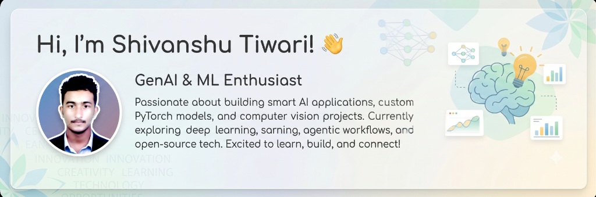

<div align="center">
  
</div>

<br />

<div align="center">

  <h1> Shivanshu Tiwari — AI & Machine Learning Engineer Portfolio</h1>

  <p>
    <b>A Interactive Portfolio built with React 19, Vite 6, TypeScript, Motion & Lenis Smooth Scroll</b>
  </p>

  <p align="center">
    <a href="https://github.com/Shivanshu85" target="_blank">
      
    </a>
    <a href="https://www.linkedin.com/in/shivanshu-tiwari-3170a12b2" target="_blank">
      
    </a>
    <a href="https://x.com/it_shivanshu99" target="_blank">
      
    </a>
    <a href="mailto:tshivanshu48@gmail.com">
      
    </a>
  </p>

  <p align="center">
    
    
    
    
    
  </p>

</div>

---

##  Executive Overview

This repository houses the source code for **Shivanshu Tiwari's AI & Machine Learning Engineering Portfolio**. 

Built from first principles, this web application features a **3-stage dynamic scrolling experience** designed to present complex AI/ML research projects (including electro-optical UAV surveillance systems developed at **IRDE, DRDO - Ministry of Defence, Govt. of India**), LLM agent workflows, data engineering pipelines, and full-stack software achievements.

### Key Highlights
-  **DRDO Defense AI Research**: Includes production details and metrics for *DroneVision* (Custom PyTorch CNN+FPN detector) and *SwarmTally* (YOLOv8 + FastAPI multi-drone counter achieving **0.94 mAP@0.50**).
-  **GenAI & Agent Systems**: Features *MCP Doctor* (evidence-based diagnostic tool for Model Context Protocol & AI tools) and *CineCurator* (FastAPI + Scikit-learn TF-IDF content recommendation engine).
-  **Automated Resume Engine**: Built-in NodeJS script (`npm run generate:resume`) using **jsPDF** to programmatically generate pixel-perfect PDF resumes into `public/`.
- **Fluid 3-Stage Scroll Architecture**: Seamless transitions between **Dark Intro Landing Page**, **Light Interactive Workspace**, and **Dark Closing / Contact Stage**.

---
##  Technology Stack & Logos

### Frontend Framework & Styling


### AI, Machine Learning & Computer Vision


### LLM, Agentic AI & Data Engineering


### DevOps & Cloud Infrastructure


---

##  Architecture & User Experience Flow

The application is structured into a state-driven single page application (SPA) with **three distinct scrolling states**:

```
 ┌────────────────────────────────────────────────────────────────────────┐
 │                         1. LANDING STAGE                              │
 │   - Dark Theme (#0A0A0B)                                               │
 │   - High-impact Header, Status Pill, Quick Bio & Navigation Prompts    │
 └───────────────────────────────────┬────────────────────────────────────┘
                                     │  (Scroll Down / Drag / Click)
                                     ▼
 ┌────────────────────────────────────────────────────────────────────────┐
 │                        2. WORKSPACE STAGE                              │
 │   - Light Theme (#F7F7F4)                                              │
 │   - Interactive Sidebar (Navigation & Social Links)                    │
 │   - Hero Profile & Live Context Card                                   │
 │   - Featured Projects Showcase (Grid + Modal View + Metrics)           │
 │   - Core Engineering Capabilities Matrix                               │
 │   - Technical Skills Grid & OCI Certifications                          │
 │   - Research & Internship Timeline (DRDO IRDE, Codec Tech)              │
 │   - "How I Build" 5-Step Methodology                                   │
 │   - Interactive PDF Resume Downloader                                  │
 └───────────────────────────────────┬────────────────────────────────────┘
                                     │  (Reach End of Workspace + Scroll)
                                     ▼
 ┌────────────────────────────────────────────────────────────────────────┐
 │                         3. CLOSING STAGE                              │
 │   - Dark Theme (#0A0A0B)                                               │
 │   - Direct Email Contact Form & Social Links Card                       │
 │   - Quick "Back to Top" Smooth Reset                                   │
 └────────────────────────────────────────────────────────────────────────┘
```

### Stage Transition Mechanics
- **Direction-Aware Animations**: Transitions utilize `motion/react` with custom blur filters (`blur(16px)` to `blur(0px)`), slide offsets (`y: ±16px`), and custom easing (`[0.22, 1, 0.36, 1]`).
- **Gesture & Wheel Debouncing**: Wheel scrolling and touch swipes (`touchmove`) are listened to with sub-300ms lockouts to prevent accidental double-skips.
- **Lenis Smooth Scroll**: Provides momentum-based scrolling across the workspace content.

---

##  Featured AI & Software Projects

| Project | Category | Key Tech Stack | Key Metrics / Achievements | Live / Repository Links |
| :--- | :--- | :--- | :--- | :--- |
| **DroneVision** | Defense AI & Computer Vision | `PyTorch` · `Custom CNN` · `FPN` · `CIoU Loss` | Built from scratch for DRDO IRDE; Custom CNN + FPN for small UAV detection | [](https://github.com/Shivanshu85/DroneVision) [](https://huggingface.co/spaces/sam9507/DroneVision) |
| **SwarmTally** | Real-Time Aerial Counter | `YOLOv8` · `FastAPI` · `Next.js` · `Docker` · `CI/CD` | **0.94 mAP@0.50**, **0.94 Precision**, **0.89 Recall** on DRDO validation | [](https://github.com/Shivanshu85/Swarmtally) [](https://swarmtallycom-lovat.vercel.app) |
| **CineCurator** | AI Discovery Platform | `Next.js 14` · `FastAPI` · `Scikit-learn` · `Supabase` | Content-based TF-IDF + Cosine Similarity engine; 4-tier fallback path | [](https://github.com/Shivanshu85/Cinecurator) [](https://cinecurator-one.vercel.app) |
| **MCP Doctor** | AI Dev Tooling / MCP | `Python` · `MCP Protocol` · `CLI` · `Testing` | 8 Runtime Probes, 5 AI Clients supported, **96% Test Coverage** | [](https://github.com/Shivanshu85/MCP-Doctor) |
| **Google Flow Automation** | AI Workflow Automation | `JavaScript` · `Chrome Extension` · `AI Media` | 5 Generation Modes for batch prompt entry & queue management | [](https://github.com/Shivanshu85/Google-Flow-Automation) |

---
##  Professional Experience & Research

### 🇮🇳 ML Intern — DRDO, Ministry of Defence, Govt. of India (IRDE)
*May 2026 — July 2026 | Dehradun, Uttarakhand, India*

- **DroneVision**: Researched and developed a single-class electro-optical UAV detector from first principles in PyTorch. Designed a custom CNN backbone, Feature Pyramid Network (FPN), multi-scale detection head, CIoU loss function, Non-Maximum Suppression (NMS), and data augmentation without external detection libraries.
- **SwarmTally**: Architected an end-to-end multi-drone detection and counting platform using YOLOv8, FastAPI REST microservices, Next.js dashboard, Docker containers, and CI/CD pipelines. Achieved **0.94 mAP@0.50**, **0.94 precision**, and **0.89 recall**.
- **Defense Applications**: Explored electro-optical (EO) surveillance telemetry, real-time edge inference, and future EO/IR multi-sensor fusion tracking.

---


##  Certifications & Qualifications

- 📜 **Oracle Cloud Infrastructure 2025 Certified Generative AI Professional**
- 📜 **Oracle Cloud Infrastructure 2025 Certified Data Science Professional**
- 📜 **Oracle Cloud Infrastructure 2025 Certified AI Foundations Associate**
- 📜 **Generative AI Certification** (Professional Certification)
- 📜 **Artificial Intelligence Intern Certification** (Codec Technologies India)

---


##  Contact & Connect

**Shivanshu Tiwari**  
*ML Intern @ DRDO \| GenAI & LLM Engineer \| Data Engineer*  
 Deoria / Lucknow, Uttar Pradesh, India  

- **Email**: [tshivanshu48@gmail.com](mailto:tshivanshu48@gmail.com)
- **GitHub**: [github.com/Shivanshu85](https://github.com/Shivanshu85)
- **LinkedIn**: [linkedin.com/in/shivanshu-tiwari-3170a12b2](https://www.linkedin.com/in/shivanshu-tiwari-3170a12b2)
- **X / Twitter**: [x.com/it_shivanshu99](https://x.com/it_shivanshu99)

---

<div align="center">
  <sub>Built with ❤️ by Shivanshu Tiwari using React 19, Vite 6, TypeScript & Tailwind CSS.</sub>
</div>
